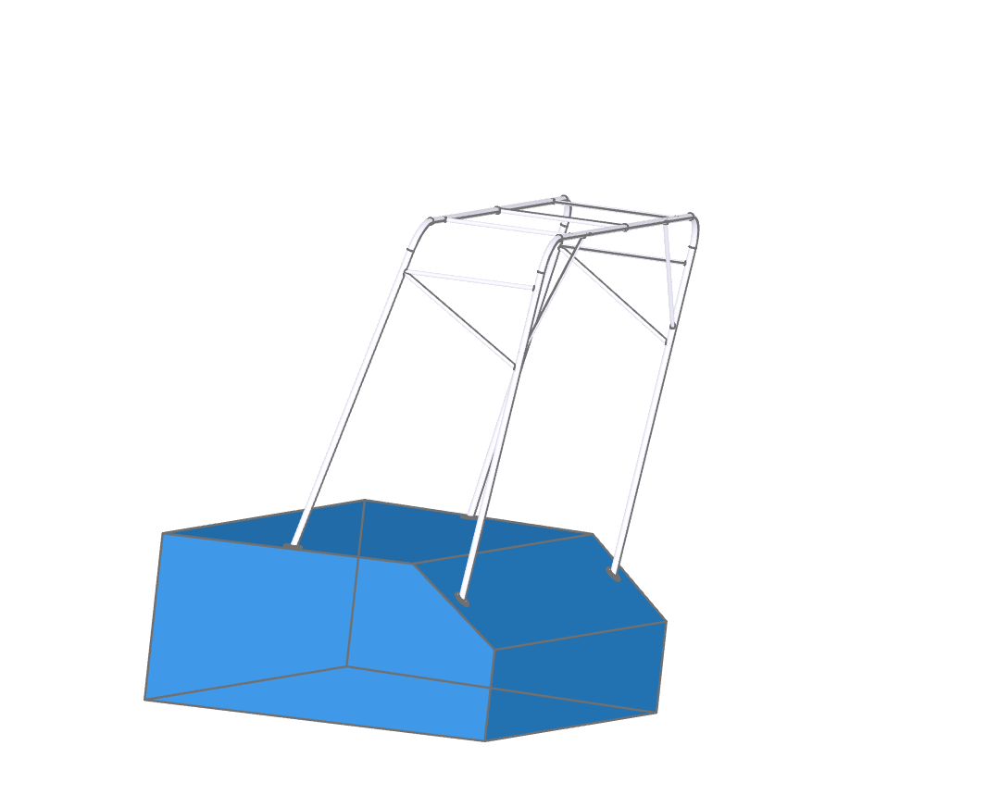

# build123d-solar-arch

Parametric 3D model of a **solar panel support arch**, generated in code with [build123d](https://build123d.readthedocs.io/) (Python CAD on OpenCASCADE). The script builds the complete structure — frames, feet, crossbars, braces, and lifting padeyes — from a handful of parameters, renders it in the ocp-vscode 3D viewer, and exports an STL mesh. It also builds a **crude sailboat stern context model** alongside the arch (front feet on the horizontal deck, back feet on the sloping transom) purely for visualization — the context hull is a separate part and never enters the STL export or the mass estimate.



## The model

A 3.5 m wide portal-style frame made of 40 mm round tube (2 mm wall), with:

- **Front and back frames** — near-vertical legs with filleted corners (R200) and horizontal top rails at 2 m
- **ArchFeet** — Ø100 × 8 mm base plates with a Ø30 centre hole and 3× Ø8.5 bolt holes (PCD 75)
- **Top support & center support** — Ø25 crossbars spanning front ↔ back at the top
- **Two sloped side rails** — Ø25 parallel rails near the base of the legs (intended panel-mounting rails)
- **Diagonal brace** — Ø25 bracing in the plane of the back frame
- **Two padeyes** — Ø25 half-torus lifting lugs on the outside of the back top rail
- The half-model is mirrored about mid-span for a symmetric structure

A **crude stern-context hull** is shown beside the arch (translucent, not fused):
a flat deck at z=0 carries the front (flat) feet, while the back (tilted) feet
rest on a sloped transom/scoop surface. The scoop plane is *measured from the
arch's own back feet* (`back_foot_angle`, `drop`), and the hull is carved so
that plane becomes its aft top surface — the arch therefore always sits flush
on the hull. See the `boat_*` / `deck_width_*` parameters.

Current export: `arch.stl`, arch only (~7 MB, ~144k triangles); the context hull
is never included.

## Requirements

- Python 3.13 + conda environment `ocp` (build123d 0.11.1, cadquery-ocp-novtk, ocp-vscode, numpy, …)

Create the environment:

```bash
conda env create -f environment.yaml   # env name: ocp
```

## Running

```bash
cd /path/to/build123d-solar-arch   # run from the project root
conda activate ocp
python solar_arch.py
```

This builds the model, sends it to the 3D viewer (`show(arch2, boat)`), and writes `arch.stl` (`export_stl`) plus `arch.png` (`save_screenshot`, requires the viewer to be open).

> **Headless runs:** pass `--no-viewer` to skip `show()`/`save_screenshot()` while
> still building the geometry, running the fit checks, and exporting `arch.stl`:
> `python solar_arch.py --no-viewer`.

> **Run from the project directory.** `solar_arch.py` is opened relative to your
> current working directory, not the script's location. If you get
> `python: can't open file '.../solar_arch.py': No such file or directory`, you are
> in the wrong folder — `cd` into this repo first (check with `pwd`).

> **No conda on PATH?** Conda isn't initialized in your shell yet. Either run once
> `<conda-prefix>/bin/conda init zsh` (e.g. `/Users/stephenday/miniconda3/bin/conda init zsh`),
> or skip activation and call the env's interpreter directly:
> `<conda-prefix>/envs/ocp/bin/python solar_arch.py`.

## Viewing & screenshots

`show()` needs a running viewer:

- **VSCode** — install the *OpenCascade CAD Viewer* extension (`bernhard-42.ocp-cad-viewer`).

  **Recommended flow:** open `solar_arch.py` as the active tab in VSCode — the
  `from ocp_vscode import *` line auto-launches the viewer (`Ocp CAD Viewer >
  Advanced: Autostart`). Confirm the viewer is up: the VSCode status bar shows
  `OCP: <port>` and `~/.ocpvscode` lists that port under `services`. Then run the
  script from **that VSCode window's integrated terminal**:

  ```bash
  python solar_arch.py
  ```

  If the viewer doesn't auto-start, open it manually via the Command Palette
  (`Cmd+Shift+P`) → **"OCP CAD Viewer: Open viewer"**. If `show()` still reports
  `Port could not be cast to integer value as 'None'`, no viewer is registered —
  ensure the viewer panel is open before running.
- **Standalone (no VSCode)** — start the built-in browser viewer:

  ```bash
  python -m ocp_vscode          # serves http://127.0.0.1:3939/viewer
  ```

  Open that URL, then run `solar_arch.py` — the model appears in the browser.

> **Version pairing:** the `ocp-vscode` Python package and the *OCP CAD Viewer*
> VSCode extension are released in lockstep and must match (currently 4.0.1).
> If `show()` fails with `KeyError` (e.g. `'none'` or `0`) in `config.status()`,
> your Python package and extension versions are out of sync — upgrade the
> Python side with `pip install -U ocp-vscode==<extension version>`.

The script saves `arch.png` automatically at the end of each run (`save_screenshot`), so the preview stays in sync with the model. To capture a different view manually:

```python
from ocp_vscode import save_screenshot
save_screenshot("other.png")    # saved relative to the process working directory
```

Or use the camera/screenshot button in the viewer toolbar.

## Parameters

All dimensions are in **millimetres** (`M` = 1000, `MM` = 1). Edit the constants at the top of `solar_arch.py`:

| Parameter | Default | Description |
|---|---|---|
| `width` | 3.5 m | total span (x direction) |
| `back_width` | 3.0 m | span between the back feet |
| `back_inset` | 0.25 m | `(width − back_width) / 2`, leg inset from the outside |
| `height` | 2.0 m | top rail height |
| `depth` | 1.0 m | front-to-back depth of the frame |
| `drop` | 0.2 m | how far the back feet sit below the deck/scoop crease (transom drop) |
| `back_foot_angle` | 40° | tilt of the back foot plates — sets the transom/scoop slope the hull is built to |
| `front_offset` / `back_offset` | 0.5 / 0.3 m | forward lean of the front / back legs at the top |
| `tube_od` / `wall_thickness` | 40 / 2 mm | frame tube outer diameter and wall thickness (ID 36 mm) |
| `cross_member_od` | 25 mm | cross-member (top support, side rails, brace, center support) outer diameter (ID 21 mm) |
| `bend_radius` | 200 mm | corner fillet radius (`5 × tube_od`) |
| `top_support_offset` | 0.25 m | top crossbar position along the top rails |
| `side_support_offset` | 0.1 m | side rails offset from the leg bottoms |
| `brace_offset` | 0.5 m | diagonal brace position along the back legs |
| `rise_rate` | 0 | experimental crown rise (`TangentArc`); `0` = flat top |
| `show_boat` | True | build & show the crude stern-context hull beside the arch |
| `boat_cx` | 1.75 m | boat centreline x (`width/2`); hull symmetric about it |
| `deck_width_aft` | 3.6 m | hull width at the aft end (`hull_aft_end`) |
| `deck_width_fwd` | 4.0 m | hull width at the forward cut |
| `hull_aft_end` | 1.3 m | hull aft extent below the scoop surface |
| `hull_len_aft` | 3.5 m | modeled hull length forward of the transom crease |
| `hull_bottom_z` | −2.6 m | flat-bottom depth |

## Project layout

```
solar_arch.py      parametric model (single script)
arch.stl           exported STL mesh
environment.yaml   conda environment (Python 3.13)
arch.png           rendered preview
LICENSE            Apache License 2.0
```

## Known issues

- **build123d 0.11.1 mirror bug:** the generic `mirror()` operation deep-copies the
  part internally, and on this geometry the copy corrupts trimmed-curve parameters
  (OCCT `Geom_TrimmedCurve::parameters out of range`). The script therefore mirrors
  via `arch2.part.mirror(plane)` (no copy) and `add()`s the result — keep that
  pattern for any new mirroring.
- `rise_rate` and the `TangentArc` branch are experimental; `back_foot_angle` and the
  `faces().sort_by(Axis.Z)[-4]` foot split index are empirical values.

## License

Apache License 2.0 — see [LICENSE](LICENSE).
